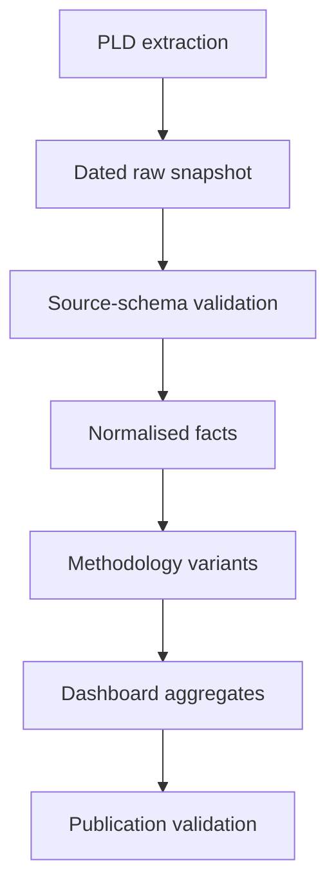

# Scraper and data-assembly rebuild design

## 1. Purpose

This document defines the contract for rebuilding the PLD scraper and data-assembly pipeline on a divergent development branch. It complements [`PLD-structure.md`](PLD-structure.md), which describes the source data, and [`validation-todo.md`](validation-todo.md), which records the outstanding research and validation programme.

The rebuild should make methodological choices explicit, reproducible and testable. Retrieval, normalisation, methodology and publication must be separate stages so that a change in an annual total can be attributed to a particular rule rather than hidden inside the scraper.

## 2. Scope of the first rebuild

The first implementation should cover conventional records from PLD residential units only. It should:

- retain application and unit identity;
- capture both application- and unit-level commencement and completion dates;
- preserve raw classifications and supersession fields;
- generate several loss-dating variants from the same source snapshot;
- reproduce the current dashboard output where possible as a comparison variant;
- produce detailed reconciliation and exception reports; and
- rebuild the published browser artefacts only after the preferred methodology is selected.

The first implementation should not silently add non-conventional accommodation, invent `Units LP2021`, resolve supersession by assumption, or redefine planning use class. Those are later, separately versioned methodology changes.

## 3. Frozen baseline

Before work starts on the divergent branch, preserve a baseline manifest for the current production pipeline. It should record:

- repository commit SHA;
- extraction timestamp and PLD `last_updated` range;
- Node.js version and relevant operating environment;
- all `PLD_*` environment settings and requested financial-year range;
- schema and methodology versions;
- application hits, unit records and address-grouped records;
- London-wide and authority/year totals;
- file inventory, byte sizes and SHA-256 checksums; and
- the output of the current validator.

The published September 2026 extraction should remain available as a frozen comparison fixture. Development runs must write elsewhere and must not overwrite `site/data` by default.

Suggested manifest shape:

```json
{
  "repository_commit": "...",
  "extracted_at": "...",
  "source": "Planning London Datahub public API",
  "requested_financial_years": ["2004/05", "2025/26"],
  "schema_version": 3,
  "methodology_version": 2,
  "counts": {
    "application_hits": 0,
    "unit_records": 0,
    "published_records": 0
  },
  "files": [
    { "path": "site/data/index.json", "bytes": 0, "sha256": "..." }
  ]
}
```

Do not treat the example zeros as expected values; populate the manifest from the frozen run.

## 4. Pipeline boundaries



### 4.1 Extraction

Responsibilities:

- query PLD and page/scroll until complete;
- preserve source application and unit fields without analytical classification;
- record requests, extraction time and hit counts;
- detect truncation, duplicate hits and mapping drift; and
- write only to a new dated snapshot.

Extraction must not decide reporting financial year, affordability, use class, supersession treatment or LP2021-equivalent units.

### 4.2 Source-schema validation

Responsibilities:

- verify required field paths and expected container types;
- record new, missing or type-changed fields;
- verify scroll totals and source identifiers;
- test flattened-index and nested-array parity if flattened indices are used; and
- produce a machine-readable validation report.

### 4.3 Normalisation

Responsibilities:

- construct stable application and source-row keys;
- parse dates without discarding invalid raw values;
- copy parent context onto fact records;
- preserve raw dimension values alongside normalised values; and
- classify exceptions and missing data.

### 4.4 Methodology

Responsibilities:

- choose the reporting date and financial year;
- assign the gain/loss sign;
- apply a named supersession rule;
- map raw categories through versioned lookup tables; and
- calculate adjusted measures only where the rule is documented.

### 4.5 Assembly

Responsibilities:

- produce authority/year summaries and filter cubes;
- produce application/site detail without losing identifiers;
- create browser-facing shards; and
- retain enough diagnostic dimensions to reconcile published totals.

### 4.6 Publication validation

Responsibilities:

- check artefact schema and internal accounting;
- compare the preferred methodology with the frozen baseline and external benchmarks;
- enforce publication gates; and
- emit a release manifest identifying the precise source snapshot and methodology.

## 5. Named methodology variants

During development, each calculation must have a stable identifier. At minimum generate:

| Identifier | Gain year | Loss year | Purpose |
| --- | --- | --- | --- |
| `completion-date-all` | Unit completion | Unit completion | Reproduce the present pipeline as closely as possible |
| `unit-commencement-losses` | Unit completion | Unit commencement | Test the most granular reading of the loss rule; missing dates remain exceptions |
| `root-commencement-losses` | Unit completion, with separately reported root fallback if required | Root application commencement | Test the literal “scheme commencement” interpretation |
| `unit-root-fallback-losses` | Unit completion, with separately reported root fallback if required | Unit commencement, then root commencement | Test a completeness-oriented phased-scheme interpretation |

Future variants such as `lp2021-equivalent` must be added only after the source scope and conversion rules have been documented. A methodology identifier must not be reused after its rules change.

Every output must identify:

- source snapshot ID;
- schema version;
- methodology identifier and version;
- category-mapping version;
- supersession-policy identifier; and
- generation timestamp and code commit.

## 6. Source-to-output field contract

Maintain a machine-readable field dictionary. For each output field it should specify:

- output name and type;
- source index and field path;
- raw, normalised, inferred or calculated status;
- transformation and permitted values;
- null and invalid-value behaviour;
- aggregation rule; and
- introduction/deprecation version.

Key requirements:

- `application_id` and `lpa_app_no` must survive into detail data;
- `lpa_name` and geographic `borough` must remain distinct;
- raw tenure, unit type and development type must be retained;
- inferred use class must be named and labelled as inferred;
- reporting date must be accompanied by `reporting_date_source`;
- root-fallback records must remain identifiable; and
- `units_lp2021` must not be populated with an ordinary count under a misleading name.

If browser compatibility temporarily requires `units_lp2021`, either remove it through a schema migration or mark it explicitly unavailable. Do not silently set it equal to `units` in the rebuilt canonical model.

## 7. Initial inclusion and exclusion matrix

This table is the default test policy, not a claim about the former dashboard. Any change must be versioned and documented.

| Source condition | Initial treatment | Diagnostic requirement |
| --- | --- | --- |
| Gain with valid unit completion date | Include | Count by date source |
| Gain without unit completion but with root completion | Variant-dependent fallback | Flag as root fallback |
| Gain without any usable completion date | Exclude from dated totals | Retain in exceptions |
| Loss with valid unit commencement | Include in unit-based variants | Count by date source |
| Loss with missing unit commencement but valid root commencement | Include only in fallback/root variants | Flag as root fallback |
| Loss without any usable commencement date | Exclude from dated totals | Retain in exceptions |
| `change_type` other than recognised Gain/Loss | Exclude pending rule | Report raw value and count |
| Missing `change_type` | Exclude pending rule | Report separately |
| Invalid or impossible date | Exclude from dated totals | Preserve raw value and reason |
| Completion earlier than commencement | Do not silently repair | Include/exclude only according to named variant and report anomaly |
| Unit/application marked superseded | Retain initially | Flag and produce alternative totals |
| Cross-borough or duplicate-UPRN candidate | Retain initially | Flag for reconciliation |
| Missing reporting authority | Retain as unallocated where otherwise valid | Report separately |
| Current incomplete financial year | Separate provisional output | Never merge into completed-year series without warning |

## 8. Date semantics

The implementation must document and test:

- accepted raw formats, initially strict `dd/MM/yyyy` plus explicitly enumerated observed alternatives;
- financial years running from 1 April through 31 March;
- date-only treatment without invented times or time zones;
- impossible, ambiguous and partially populated dates;
- differences between root and unit dates, including different financial years;
- phase-specific dates and missing `phase_detail`;
- root fallback precedence;
- commencement after completion; and
- the effect of each date-source category on annual totals.

Never coerce an invalid date into a different valid date. Retain `raw_date`, `parsed_date`, `date_status` and, where relevant, `fallback_reason`.

## 9. Identity and deduplication

Define separate keys and policies for:

### Application identity

Prefer the source `id`/Elasticsearch `_id` after checking their stability and equality. Retain the LPA reference as a separate field.

### Unit identity

Use a supplied stable flattened-index identifier if validated. Otherwise create a deterministic source-row key from parent application ID, source-array position and a hash of the raw unit object. Array position alone is insufficient for matching across changing PLD snapshots.

### Phase and site identity

Retain raw `phase_detail`. Do not use assembled address as a canonical site identifier. Any later site grouping should have an explicit, reproducible key and known collision behaviour.

### Distinct duplicate problems

Do not combine these under one generic deduplication operation:

- repeated Elasticsearch hits caused by paging;
- identical rows within one source application;
- original and superseding permissions;
- partial supersedence;
- separate permissions at the same address;
- cross-boundary reporting of one development; and
- genuinely repeated units within a scheme.

Each requires a separate diagnostic and, if necessary, a separately versioned rule.

## 10. Raw snapshot and retention policy

Each full extraction should create an immutable snapshot before methodology is applied. The snapshot should contain:

- raw or losslessly reduced source records;
- extraction request/query definitions;
- mappings or field inventories captured at extraction time;
- scroll totals and duplicate-hit diagnostics;
- snapshot manifest and checksums; and
- extraction warnings/errors.

The storage location and retention period may be external to the public repository. The repository should contain the snapshot format, manifest schema and instructions for reproducing a build. Generated public artefacts must cite the snapshot ID.

Partial or failed snapshots must be visibly marked and must never become publication inputs.

## 11. Reconciliation and validation hierarchy

Validation has three distinct levels.

### 11.1 Structural validation

- source and output schemas;
- required fields and types;
- complete scrolling/paging;
- valid joins and identifiers;
- date parsing;
- shard inventory and checksums.

### 11.2 Accounting validation

- facts reconcile with authority and London aggregates;
- dashboard cubes reconcile with their parent totals;
- every included, excluded and exceptional source fact is accounted for;
- unit-array counts are compared with parent residential totals;
- flattened and nested representations reconcile where applicable.

Parent totals are checks, not values to force onto unit facts. Disagreement should remain visible.

### 11.3 External validation

- dated December 2024 GLA self-contained C3/C4 benchmarks;
- GLA AMR conventional-completions series;
- borough/year benchmarks as they are found; and
- surviving former-dashboard tables or exports.

Passing structural and accounting validation does not demonstrate equivalence with GLA methodology. The test output and user-facing documentation must preserve that distinction.

## 12. Expected-difference ledger

Every experimental build should emit a reconciliation table such as:

| FY | Frozen pipeline | Tested variant | Loss-date effect | Fallback effect | Other change | GLA benchmark | Residual |
| --- | ---: | ---: | ---: | ---: | ---: | ---: | ---: |
| 2019/20 | — | — | — | — | — | 37,843 | — |
| 2020/21 | — | — | — | — | — | 30,703 | — |
| 2021/22 | — | — | — | — | — | 37,524 | — |
| 2022/23 | — | — | — | — | — | 32,053 | — |
| 2023/24 | — | — | — | — | — | 31,629 | — |

The same differences should be available by:

- planning authority and geographic borough;
- gain/loss;
- unit date, root fallback and missing date;
- phase status;
- supersession status;
- raw tenure and unit type; and
- `bo_system`/source system.

London-wide agreement is insufficient if it conceals offsetting borough errors.

## 13. Test fixtures and regression tests

Before implementing the new methodology, capture a small set of representative source documents and write expected outcomes for:

- a simple completed gain;
- a scheme containing gains and losses;
- phased commencement/completion;
- loss units missing commencement where the root date is populated;
- root and unit dates falling in different financial years;
- superseded and partially superseded permissions;
- duplicate-looking but legitimate units;
- identical addresses on separate applications;
- malformed and impossible dates;
- missing or unexpected change types;
- missing authority information; and
- representative other-residential and non-permanent records for later work.

Fixtures should be small, stable and committed where licensing and data size permit. Each expected result must state the methodology variant. Tests should cover pure transformation functions without requiring live PLD access.

Live integration tests should be separate because PLD changes retrospectively.

## 14. Performance and operational requirements

The rebuild should establish measurable bounds for:

- maximum memory use;
- extraction and assembly time;
- API request/page counts;
- retry and back-off behaviour;
- scroll expiry and recovery;
- temporary and final disk use;
- shard-size limits; and
- deterministic output ordering.

Network errors may be retried conservatively. A failed or incomplete scroll must fail the snapshot rather than return partial results. Retrying must not duplicate facts.

Where practical, generated files should be byte-for-byte deterministic for the same source snapshot, code and methodology. Volatile timestamps belong in manifests rather than otherwise deterministic fact files.

## 15. Privacy, licensing and publication content

The pipeline should retain only fields required for methodology, auditing and the public explorer. Before publishing new application-level detail, review whether any newly retained descriptions, identifiers or address fields create unnecessary personal-data or reuse risk.

Raw snapshots may contain more material than should be published. Treat extraction storage and public artefacts as separate disclosure boundaries. Continue to identify the GLA/PLD source and applicable London Datastore terms.

## 16. Failure and publication gates

### Hard failures

Publication must stop on:

- incomplete or expired scroll without verified recovery;
- returned unique hits not matching the API total;
- missing required source fields or incompatible mapping changes;
- failed parent joins;
- invalid output schema;
- detail/summary/cube accounting mismatch;
- missing or duplicate expected shards;
- checksum/manifest failure;
- an unapproved methodology identifier; or
- an attempt to publish from a partial snapshot.

### Review-required warnings

Set thresholds before the first comparison run for:

- unexpected application or unit-count movement;
- invalid and missing dates;
- increased use of root fallbacks;
- new change-type or tenure values;
- superseded records;
- unallocated authority records;
- large borough/year movement; and
- movement against external benchmarks.

Warnings above their threshold should require explicit review rather than being silently accepted by an automated refresh.

## 17. Schema migration and branch behaviour

The divergent branch must use separate output directories and must not publish to the production GitHub Pages artefact. Decide before implementation whether it will:

- emit a new schema version alongside version 3; or
- provide a compatibility assembler that can reproduce version 3 while the browser migrates.

Document:

- introduced, renamed and removed fields;
- browser compatibility by schema version;
- migration of existing tests and validators;
- treatment of historical checked-in snapshots;
- methodology/schema version increments; and
- how an experimental build is selected locally.

Prefer one canonical fact model with version-specific assemblers over parallel scraper implementations.

## 18. Branch acceptance criteria

The rebuilt pipeline is eligible to replace the current pipeline only when:

- the frozen baseline and manifest are committed or durably recorded;
- the same raw snapshot can be rebuilt reproducibly;
- methodology variants are generated from one normalised fact set;
- all included, excluded and exceptional facts are accounted for;
- date fallbacks and supersession status are visible in diagnostics;
- transformation functions have representative regression fixtures;
- 2019/20–2023/24 London totals have a complete difference ledger;
- borough-level movements have been reviewed and material changes explained;
- output schema and browser compatibility are tested;
- failure and warning gates operate against deliberate test failures;
- public metadata identifies source snapshot, code and methodology versions; and
- the documentation accurately describes the selected methodology and remaining uncertainty.

Agreement with an external London-wide total is not, by itself, an acceptance criterion.

## 19. Suggested branch work order

1. Freeze and checksum the present dataset and validator output.
2. Capture live mappings and the diagnostic probes specified in `PLD-structure.md`.
3. Commit representative source fixtures and expected current-method results.
4. Implement extraction into an immutable raw-snapshot format.
5. Implement pure normalisation and exception reporting.
6. Reproduce `completion-date-all` from the new facts and reconcile it with the frozen pipeline.
7. Add the three commencement-date loss variants.
8. Generate London and borough difference ledgers for 2019/20–2023/24.
9. Select and document the preferred loss-date rule from the evidence.
10. Build the new browser artefact schema and compatibility path.
11. Exercise failure gates and perform a non-publishing end-to-end run.
12. Merge only after the acceptance criteria above are satisfied.

